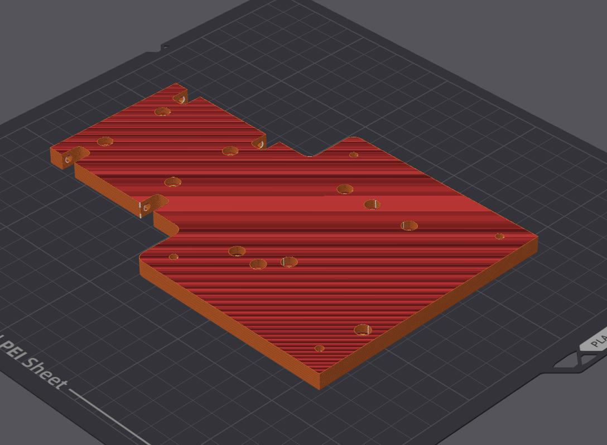

# spot-v1

## Table of Contents
1. Bill of Materials (BOM)
2. Printing List
3. Printing Orientations

## Bill of Materials (BOM)

Note: The parts I personally used do NOT have to be the parts you use. Many items listed here were chosen for convenience (Amazon), not price optimization—I definitely spent more than necessary. Feel free to substitute cheaper or alternative components as long as they meet the listed specifications.

| Quantity | Part Name | Specifications | What I Specifically Used |
| -------- | --------- | -------------- | ------------------------ |
| 4 | Wheels | Must have 14mm hex to work with stock wheel hubs | [Pro-line Racing Mirage TT 2.2"/3.0" Belted SC Tires Mounted on Raid Black 6x30 Removable Hex 12mm & 14mm Wheels 2 PRO1024811](https://www.amazon.com/gp/product/B0DJCK2HRW/ref=ox_sc_act_image_1?smid=ATVPDKIKX0DER&psc=1) (EXPENSIVE) |
| 1 | Electronic Speed Controller (ESC) | | My motor had an integrated ESC design |
| 19 | 10x15x4mm Bearings | | [uxcell 20pcs 6700-2RS Miniature Deep Groove Ball Bearings 10x15x4mm Double Sealed Bearings (Black) for Electric Motor, Home Appliances, Machinery, P6 (ABEC 3)](https://www.amazon.com/uxcell-Miniature-10x15x4mm-Appliances-Machinery/dp/B0DCP34B1W/ref=sr_1_4?dib=eyJ2IjoiMSJ9.CSQeSABBo8m54f7dGYjQrCJ73Tj7V6I5TyH3S1sPj_6GJKJvsXY_I9hpo5GlnL-zg5W-NnUrrmf6RgMs-GQmXhw6kZLIcOjCQz_h_HL7oCzyGIF6IDg7kGH7lLJCOtqrlIj3hoqQexGGliyNmgj66_VFa5-s52DPiskYvh0nly7Fn3R193Tf05gkKe-B98uvjvipDEOZz9D_XfGN8iExXNus4sG0wd0FCtLu7r5uklQ.MRtb1rx2KA65PZslj3u0flJFpr_-65j1KpaWVwgLBcc&dib_tag=se&keywords=10x15x4&qid=1763082662&sr=8-4&th=1) |
| 4 | M4 Nylon Locknut | | [M4 Locknuts 100PCS Metric Nylon Inserted Hex Lock Nuts Self-Lock Nylon Insert M4x0.7mm Carbon Steel Self Locking 7mm Hex Nut Driver Tiny Nut for RC Cars 3D Printer](https://www.amazon.com/Locknuts-Inserted-Self-Lock-M4x0-7mm-Locking/dp/B0DFY7G8V3/ref=sr_1_5?crid=1X43XWZTRKFZN&dib=eyJ2IjoiMSJ9.6B0-lnhOxHLLle56ojlHyqTe--2b56wnxc7nwBrh9aQn9bT9s7aT2y7kP_F_5Vp4tjOzipHMQykIAFjHEcdq01GLEjw2ETSJLKPNCjqZkus7-k0vSsUXVrjL-8GiMUL5wi4fZmW16OUxzCsD4q7rsEByDArPqaJI0s6jJI-ZDEoCbvpag8IS0J-HVL8D-ZU-M4eC2fpL94cR2qLtLTZBFMP9c6fLSmd9zFZXFqgQPzA.c6grK5jz8vhpYRfHfnHClLlbLYo_9a9198JuBquJWrk&dib_tag=se&keywords=m4%2Blocknuts&qid=1763082706&sprefix=m4%2Blocknuts%2Caps%2C84&sr=8-5&th=1) |
| 2 | Differential | 3D-printable differential case fits [this](https://www.amazon.com/Mirthobby-Housing-Complete-Volcano-Unassembled/dp/B07YWQ7G9Q/ref=sr_1_8?crid=2HGFF58IC6VDG&dib=eyJ2IjoiMSJ9.B135ZhwDRcLHscMuJL3t35FUZ1vcloOZnjXla490Vfs4YTtX5WHwSWlvXnDmm1gaz1vEzGqqNVZI2RQQ6teVsDEb7NizAd6gh5cTlpmtTRNsfqjZdQDu4YdFVJSzQKtfJoVVzPUTEbweSeJ0ymOzxoJzFZYqL8Yj0tx8wry7itpWAimO0vnUFtqDa70ouoHZQxSUy9QBKVngDCu4xAKzS2uzfxJzrVW9AZoyHsvEXeUIFmJDIHGnMSwDvcYdLrRd1iYOyIfZ6lEN14OA9RS2OIvsAPzVcs3REdneZWnxuEM.mKetOsFTOlfqe2do2K_Po0egspEyrikBAXE6hKNAltw&dib_tag=se&keywords=front+differential+1%2F10&qid=1763080322&sprefix=front+differential+1%2F10%2Caps%2C108&sr=8-8) specific differential | [Vgoohobby Front & Rear Gear Box Housing Complete Set Drive & Diff Gear Compatible with HSP Redcat Himoto Volcano EPX 1/10 RC Car 94106 94107 94108 94111 94123 94170,Unassembled](https://www.amazon.com/Mirthobby-Housing-Complete-Volcano-Unassembled/dp/B07YWQ7G9Q/ref=sr_1_8?crid=2HGFF58IC6VDG&dib=eyJ2IjoiMSJ9.B135ZhwDRcLHscMuJL3t35FUZ1vcloOZnjXla490Vfs4YTtX5WHwSWlvXnDmm1gaz1vEzGqqNVZI2RQQ6teVsDEb7NizAd6gh5cTlpmtTRNsfqjZdQDu4YdFVJSzQKtfJoVVzPUTEbweSeJ0ymOzxoJzFZYqL8Yj0tx8wry7itpWAimO0vnUFtqDa70ouoHZQxSUy9QBKVngDCu4xAKzS2uzfxJzrVW9AZoyHsvEXeUIFmJDIHGnMSwDvcYdLrRd1iYOyIfZ6lEN14OA9RS2OIvsAPzVcs3REdneZWnxuEM.mKetOsFTOlfqe2do2K_Po0egspEyrikBAXE6hKNAltw&dib_tag=se&keywords=front+differential+1%2F10&qid=1763080322&sprefix=front+differential+1%2F10%2Caps%2C108&sr=8-8) |
| 1 | Servo | Any 35kg servo | [35kg high Torque Coreless Motor servo Metal Gear Digital and Stainless Steel Gear servo arduino servo for Robotic DIY,RC car (Control Angle 180°)](https://www.amazon.com/ZOSKAY-Coreless-Digital-Stainless-arduino/dp/B07SBYZ4G5/ref=sr_1_6?crid=VQ226COSLCW3&dib=eyJ2IjoiMSJ9.nGGXFHlriM7Gy-uccRJxP0a3iFHzeZcmmO2aV-M1t-cBkeXi9Llql-9xqUf9T8b-O47AgHJu443KWktxwmFNkySnPKelLxOgLMzC0fNLxlf_nuLzAxpJLGE3LWS743jxCMzGwxm15-D4w3wre19YhKKGXv62lDQSGm5GQzABaPIsddlnyWDroxcmHvO0evHclTWOAoE73rh9tiqDWUNlRfpKOsWOtB1O6wjqRF-8TJvS2N8bSMhrOp5_GuE8MzLOsdmNHUaaPm4usOcEo1-VSlq8xSHoTlLHjs5jy02T0vM.SLkzSX2bFxze-Z5rTRKG_9C86N3COwNnEEqz2PnF4dc&dib_tag=se&keywords=35kg%2Bservo&qid=1763082741&sprefix=35kg%2Bservo%2Caps%2C103&sr=8-6&th=1) |
| 5 | Tie Rod | | [10Pcs ShareGoo M3 Tie Rod End Ball Head Holder Link 3mm Thread Ball Joint Compatible with Tamiya Redcat HSP Traxxas Axial SCX10 1/10 RC Car Truck Boat DIY Robot Airplane,L22mm (Black)](https://www.amazon.com/ShareGoo-Holder-Compatible-Traxxas-Airplane/dp/B09JLKLK73/)
| 1 | Motor | | [QUICRUN Fusion SE (2in1 FOC system)](https://www.hobbywingdirect.com/products/quicrun-fusion-se?srsltid=AfmBOooR_tzZrnrjS6YhZbBL7E6MB15C-BGALBMK_PdF3spzsdsJmxlQ&variant=40597819687027) (EXPENSIVE)
| 1 | 20T Timing Pulley | Must be GT2 type and have 8mm bore | [Zeberoxyz 2PCS Set GT2 Synchronous Wheel 20&40 Teeth 8mm Bore Aluminum Timing Pulleys with 2PCS Length 200mm Width 6mm Belt (20-40T-8B-6)](https://www.amazon.com/Zeberoxyz-Synchronous-Aluminum-Timing-20-40T-8B-6/dp/B09JWM98SM/ref=sr_1_2?crid=2Y6BKREG0W48T&dib=eyJ2IjoiMSJ9.b1GMYWLFzsFx3BrDJmCyrXwITWTNSwzkRXG7PCGXDsrcPapeU4Hn3StSUNgRoKOQ19Uw-_L1vXjvu6yy9ErGRQhM34DDww-TWOtAUH37gmaBG1TATN3kSApkhHvtwusfieWEjtYKZsc9U4JwSNUBjiSQ_U3liZXEl1vI6eoFLhPIJ_O_1a9QbwyzRJytz3Kdx72U1sXaQDCUWjh1xGAAH0bHJzX0vxBh_YpRXDow3yA.51bMmx4UVv9_k04xxom1d80hyCvuULy2Pjs-RqW0iCM&dib_tag=se&keywords=40t%2Band%2B20t%2Btiming%2Bpulley%2B8mm%2Bbore&qid=1763084348&sprefix=40t%2Band%2B20t%2Btiming%2Bpulley%2B8mm%2Bbore%2Caps%2C71&sr=8-2&th=1)
| 1 | 40T Timing Pulley | Must be GT2 type and have 8mm bore | [Zeberoxyz 2PCS Set GT2 Synchronous Wheel 20&40 Teeth 8mm Bore Aluminum Timing Pulleys with 2PCS Length 200mm Width 6mm Belt (20-40T-8B-6)](https://www.amazon.com/Zeberoxyz-Synchronous-Aluminum-Timing-20-40T-8B-6/dp/B09JWM98SM/ref=sr_1_2?crid=2Y6BKREG0W48T&dib=eyJ2IjoiMSJ9.b1GMYWLFzsFx3BrDJmCyrXwITWTNSwzkRXG7PCGXDsrcPapeU4Hn3StSUNgRoKOQ19Uw-_L1vXjvu6yy9ErGRQhM34DDww-TWOtAUH37gmaBG1TATN3kSApkhHvtwusfieWEjtYKZsc9U4JwSNUBjiSQ_U3liZXEl1vI6eoFLhPIJ_O_1a9QbwyzRJytz3Kdx72U1sXaQDCUWjh1xGAAH0bHJzX0vxBh_YpRXDow3yA.51bMmx4UVv9_k04xxom1d80hyCvuULy2Pjs-RqW0iCM&dib_tag=se&keywords=40t%2Band%2B20t%2Btiming%2Bpulley%2B8mm%2Bbore&qid=1763084348&sprefix=40t%2Band%2B20t%2Btiming%2Bpulley%2B8mm%2Bbore%2Caps%2C71&sr=8-2&th=1)
| 1 | 120mm Timing Belt | Must be GT2 type | [uxcell 10pcs 2GT Timing Belt Closed Loop Rubber Belts 120-2GT-6, 6mm Width x 120mm Length, 3D Printer Timing Belt](https://www.amazon.com/uxcell-Timing-Closed-120-2GT-6-Printer/dp/B0CMHVQJCM/ref=sr_1_4?crid=LLWNCRXCQD7Y&dib=eyJ2IjoiMSJ9.8tZ_BnG_CGnqs9CI8AoOurQA40NTwFLYxISR3_jHYEO-S_mhi4CdCxwBL8WtyQCdiWOkHFcnM4KZUood-6YKrI7qyfvLeLHUx58PJIPiAFgJznb1mIFkqFcXNyQ9CeDx1jZ-b6qB88yQAgZPtxmGJjAu2lTnOBmFBZKX6fDJuEwf1NoTJL5qIgc04QYshlHhZwgzUh8uKiEaSDLQR_PvsEP-_3hje55lej5O_8qi2SQ.ryYTgQpu-ZPekkBvYQCgEIA9B5pKhhlmOzveotAJ2_E&dib_tag=se&keywords=120mm%2Btiming%2Bbelt&qid=1763084479&sprefix=120mm%2Btiming%2Bbelt%2Caps%2C72&sr=8-4&th=1)

## Printing List
| Quantity | Part Name | Description |
| -------- | --------- | ----------- |
| 1 | [Front Chassis](cad/Front_Chassis.step) | Main structural front frame holding servo, steering linkages, and front suspension system|
| 1 | [Rear Chassis](cad/Rear_Chassis.step) | Main structural rear frame holding motor, belt drive, and rear suspension system|
| 1 | [Right Reinforcement Beam](cad/Right_Reinforcement_Beam.step) | Connects front chassis to rear chassis |
| 1 | [Left Reinforcement Beam](cad/Left_Reinforcement_Beam.step) | Connects front chassis to rear chassis |
| 2 | [Lower Differential Case](cad/Lower_Differential_Case.step) | Protective housing for differential |
| 2 | [Upper Differential Case](cad/Upper_Differential_Case.step) | Protective housing for differential |
| 2 | [Upper Control Arm Bracket](cad/Upper_Control_Arm_Bracket.step) | Mounting bracket for the upper control arms to attach to the chassis |
| 1 | [Rear Belt Housing](cad/Rear_Belt_Housing.step) | Protective housing for belt drive system |
| 1 | [Front Belt Housing](cad/Front_Belt_Housing.step) | Protective housing for belt drive system |
| 4 | [Upper Control Arm](cad/Upper_Control_Arm.step) | Upper suspension arm that connects uprights to the chassis |
| 1 | [Rear Left Lower Control Arm](cad/Rear_Left_Lower_Control_Arm.step) | Lower suspension arm that connects uprights to the chassis |
| 1 | [Rear Right Lower Control Arm](cad/Rear_Right_Lower_Control_Arm.step) | Lower suspension arm that connects uprights to the chassis |
| 1 | [Front Left Lower Control Arm](cad/Front_Left_Lower_Control_Arm.step) | Lower suspension arm that connects uprights to the chassis |
| 1 | [Front Right Lower Control Arm](cad/Front_Right_Lower_Control_Arm.step) | Lower suspension arm that connects uprights to the chassis |
| 1 | [Electronics Bed](cad/Electronics_Bed.step) | Strengthens connection between front and rear chassis and acts as mounting plate for electronics (ESC, reciever, LiPo, etc) |
| 4 | [Differential Drive Cup Adapter](cad/Differential_Drive_Cup_Adapter.step) | Adapter between differential output and drive cup |
| 4 | [Differential Drive Cup](cad/Differential_Drive_Cup.step) | Cup that connects differential output to drive the wheels |
| 1 | [Front Belt Cup](cad/Front_Belt_Cup.step) | Outputs power to the front differential |
| 1 | [Rear Belt Cup](cad/Rear_Belt_Cup.step) | Outputs power to the rear differential |
| 1 | [Front Driveshaft](cad/Front_Driveshaft.step) | Transmits power from the belt drive to the front differential |
| 1 | [Rear Driveshaft](cad/Rear_Driveshaft.step) | Transmits power from the belt drive to the rear differential |
| 2 | [Front Upright](cad/Front_Upright.step) | Front wheel carrier that allows the steering knuckles to pivot and houses the wheel drive cup |
| 2 | [Rear Upright](cad/Rear_Upright.step) | Rear wheel carrier housing the wheel drive cup |
| 2 | [Pinion Carrier](cad/Pinion_Carrier.step) | Holds differential pinion gears in place |
| 1 | [Left Steering Knuckle](cad/Left_Steering_Knuckle.step) | Allows wheels to pivot for steering input |
| 1 | [Right Steering Knuckle](cad/Right_Steering_Knuckle.step) | Allows wheels to pivot for steering input |
| 1 | [Servo Mount](cad/Servo_Mount.step) | Holds servo securely in place |
| 1 | [Servo Steering Linkage](cad/Servo_Steering_Linkage.step) | Transmits servo power to the steering bar |
| 1 | [Steering Bar](cad/Steering_Bar.step) | Main steering bar linking left and right wheels |
| 1 | [Steering Linkage](cad/Steering_Linkage.step) | Follows same motion as the steering linkage to keep the steering bar in place |
| 1 | [Motor Shaft Adapter](cad/Motor_Shaft_Adapter.step) | Adapts motor shaft to the timing pulley |
| 4 | [Wheel Drive Cup](cad/Wheel_Drive_Cup.step) | Connects wheel hubs to the differential output cups |
| 4 | [Wheel Hub](cad/Wheel_Hub.step) | Mounting point for wheels |

## Printing Orientations

